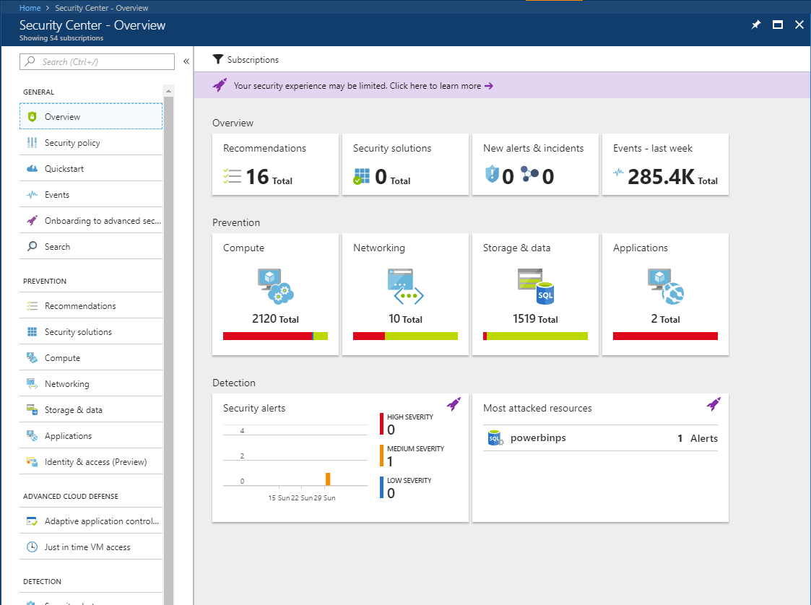

<a name="legacy-blades"></a>
## Legacy Blades

This document covers the legacy blade model. In this model, blades contain parts and lenses, which are groups of parts. Parts are also referred to as tiles. New experiences should not use this programming model as the UX is not inline with the latest Azure design patterns, and the APIs are legacy and are in basic maintenance mode.

New experiences should be built using one of the new blade programming models defined in [top-extensions-blades.md](top-extensions-blades.md).

A blade is the vertical container that acts as the starting point for any journey. You can define multiple blades, each of which contains a collection of statically defined lenses and parts.

The following image contains a legacy blade.



**NOTE**: In this discussion, `<dir>` is the `SamplesExtension\Extension\` directory, and  `<dirParent>`  is the `SamplesExtension\` directory, based on where the samples were installed when the developer set up the SDK. If there is a working copy of the sample in the Dogfood environment, it is also included.

Blades can be created in any PDL file. They are aggregated at compile time into the extension definition, as in the code located at `<dir>\Client\V1\Blades\Locked\Locked.pdl`. The code is also in the following example.

```xml
<Blade Name="LockedBlade"
       ViewModel="LockedBladeViewModel">
    <Lens>
        ...
    </Lens>
</Blade>
```

Blades use ViewModels to drive dynamic content, including titles, icons, and status.  The following is a list of legacy blade subtopics.

| Type                              | Document                                                   | Description |
| --------------------------------- | ---------------------------------------------------------- | ----------- |
| Controlling blade UI              | [portalfx-blades-ui.md](portalfx-blades-ui.md)             | Customizing blade behavior and experience | 
| Opening and closing legacy blades | [top-blades-legacy-opening-and-closing.md](top-blades-legacy-opening-and-closing.md)        | How to open blades using the legacy declarative APIs.  How to close the current blade that was called from a blade or a part container.    |
| Blade parameters                  | [portalfx-blades-parameters.md](portalfx-blades-parameters.md) | Explicit declaration for parameters that blades are required to receive.    |  
| Blade properties                  | [portalfx-blades-properties.md](portalfx-blades-properties.md) | Information sent to the blade as a `BladeParameter` is also sent to the blade ViewModel by using  a `<Property>` element. | 
| Blade outputs                     | [portalfx-blades-outputs.md](portalfx-blades-outputs.md)       | A list of output properties that return data from a child blade back to the calling blade. | 
| Pinning blades                    | [portalfx-blades-pinning.md](portalfx-blades-pinning.md)       | Pinning a blade creates a part on the currently active dashboard.    | 