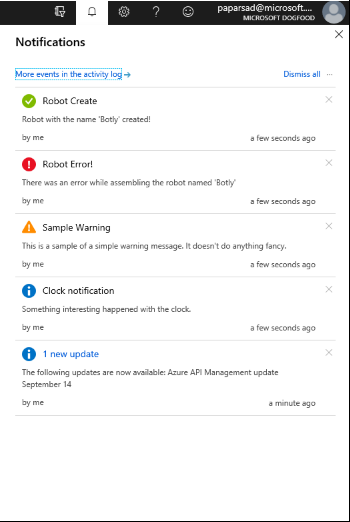

<a name="notifications"></a>
## Notifications

A notification is a short message that informs the user about an event that has occurred, or may occur, in the system. Notifications contain useful and relevant information.

The Notifications menu aggregates messages across all portal extensions and cloud-connected services. It does this by using local client notifications and global server events from the event service. Messages can be informational, warnings, or errors, as in the following image.



If you are using one of the older, PDL-based Notifications APIs, use the Notifications v3 upgrade guide located [here](/portal-sdk/generated/portalfx-notifications-upgrade.md) to convert your code to a newer edition.

<a name="notifications-notification-statuses"></a>
### Notification statuses

The following list contains the correct statuses for notifications -

**InProgress:** Long-running operation has started or is executing. It may be creating new resources or changing state.

**Info:** Successful or non-critical updates, like state changes, that do not require action on the part of the user. Some examples are stopped websites and services.

**Warning:** Problem or issue that might require attention, or could result in a more critical error. One example is a certificate that is about to expire. Urgent problem or condition that needs immediate action or attention. 

**Error:** Problem or condition that should be investigated, like data loss.

NOTE: Use the Info notification instead of the Success notification, which is being deprecated.

<a name="notifications-best-practices-for-notifications"></a>
### Best Practices for notifications

- Avoid raising notifications that users will not care about, or will not act on to resolve an issue.

- Avoid using multiple notifications when a single notification will suffice.

- Do not use notifications too often. Use them as sparingly as possible.

- Be as specific as possible, and follow the voice and tone guidelines when defining notifications. Notifications might be referenced out of context. Consequently, generic messages may not make sense or may not provide enough information leaving the user confused.

- Associate notifications with assets or blades, and ensure there is a clear next-action. When a notification is clicked, the related asset or blade is opened. If a notification does not have an asset, it is essentially a useless dead-end.

<a name="notifications-client-notifications"></a>
### Client notifications

- Local client notifications are only visible in the current browser session. When the browser is refreshed or closed , all local client notifications are lost.

- Only use local client notifications if the error originates on the client and does not apply to other users.

- If you need to open a different blade based on asset metadata, or open a blade from another extension, use dynamic blade selection on the associated asset type. If you need to open a different blade for a specific message, the extension should change the associated asset before re-publishing the notification.

<a name="notifications-one-time-notification-using-event-service"></a>
### One-time notification (using event service)

The design of the extension may require one-time notifications that are not part of a long-running operation and do not result in server events. In these instances, the extension should publish a notification with the title, description, status, and linked asset or deeplink to their service. When the notification is clicked, the associated asset or deeplink will be opened.

To link a notification to an asset, the extension specifies the asset details, as in the following example-

```
MsPortalFx.Hubs.Notifications.ClientNotification.publish({
    title: resx.myEvent.title,
    description: resx.myEvent.description,
    status: MsPortalFx.Hubs.Notifications.NotificationStatus.Information,
    asset: {
        extensionName: ExtensionDefinition.definitionName,
        assetType: ExtensionDefinition.AssetTypes.MyAsset.name,
        assetId: assetId
    }
});
```

To link a notification to a blade directly, the extension specifies the blade details, as in the following code-

```
MsPortalFx.Hubs.Notifications.ClientNotification.publish({
    title: resx.myEvent.title,
    description: resx.myEvent.description,
    status: MsPortalFx.Hubs.Notifications.NotificationStatus.Information,
    linkedBlade: {
        extension: "extensionName",
        detailBlade: "BladeName",
        detailBladeInputs: {
            bladeInputProperty1: "bladeInput1"
        }
    }
});
```

To link a notification to a deeplink, the extension specifies the deeplink URI, as in the following code- 

```
MsPortalFx.Hubs.Notifications.ClientNotification.publish({
    title: resx.myEvent.title,
    description: resx.myEvent.description,
    status: MsPortalFx.Hubs.Notifications.NotificationStatus.Information,
    uri: "#asset/HubsExtension/ResourceGroups/subscriptions/12345689-dg32-4554-9a9a-b6e983273e5f/resourceGroups/Default"
});
```

<a name="notifications-targeted-notifications-using-iris"></a>
### Targeted notifications(using Iris)

Iris is a service used to set up campaigns and target specific users/subscriptions to send notifications to in the portal. This is the only way to show notifications to users at/near startup time. The portal provides Iris a schema to use when publishing notifications which can be viewed [here](https://microsoft.sharepoint.com/teams/azureteams/aapt/azureux/portalfx/_layouts/15/WopiFrame.aspx?sourcedoc={c57ed3dc-3b5c-4c1d-8633-d64b0b6c79cb}&action=edit&wd=target%28Hubs%2FNotifications.one%7C975dc327-f8f3-49b2-b4f4-7b135e6beeac%2FIRIS%5C%2FOneRM%20Notifications%7Cae8f0c94-44d7-4523-afa8-293ae89120d2%2F%29&wdorigin=703).
		
- To onboarding to Iris, contact [Abhishta Paranjpe](mailto:abhishp@microsoft.com).
- Documentation related to Iris can be found at -
	- https://osgwiki.com/wiki/Category:Iris 
	- https://osgwiki.com/wiki/Iris_Insights_Beacons#RIS_Beacons 

<a name="notifications-targeted-notifications-using-iris-examples-of-each-kind-of-notification-using-iris"></a>
#### Examples of each kind of notification (using iris)

Notification that launches a deep link:

```
let notificationWithDeepLink: IrisNotification = {
  $schema: "https://portal.azure.com/irisnotification/2017-07-01",
  title: "Resource updated",
  description: "<div>Your resource has been updated. Click here to launch the resource.</div>",
  buttons: [{
    id: "mybutton",
    label: "Launch my blade",
    deepLink: {
            uri: "#blade/someBlade/input/value"
    }
  }]
};
```

Notification that launches an external link:

```
let notificationWithExternalLink: IrisNotification = {
  $schema: "https://portal.azure.com/irisnotification/2017-07-01",
  title: "Report generated",
  description: "<div>Your report is now available. Click here to download the report.</div>",
  duration: "short",
  buttons: [{
    id: "mybutton",
    label: "Launch my blade",
    externalLink: {
            uri: "https://www.bing.com"
    }
  }]
};
```

Notification that contains a simple form (one email field) and a button:

```
let notificationWithSimpleForm: IrisNotification = {
  $schema: "https://portal.azure.com/irisnotification/2017-07-01",
  title: "Contact info needs updating",
  description: "<div>Please update your email address.</div>",
  duration: "short",
  fields: [
    {
      name: "email",
      label: "Email address",
      type: "email"
    }
  ],
  buttons: [
    {
      id: "SubmitButton",
      label: "Submit",
      endpoint: {
        method: "POST",
        uri: "http://someEndpoint/?email=${email}",
        body: "{"result":"${email}"}",
        successMessage: "Endpoint call succeeded",
        failureMessage: "Endpoint call failed",
        // useArmToken: true/false - optionally use ARM token to call the endpoint
      }
    }
  ]
};
```